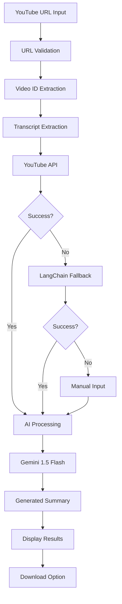

<div align="center">

# 📹 YouTube Video Summarizer

[](https://python.org)
[](https://streamlit.io)
[](https://ai.google.dev)
[](LICENSE)
[](CONTRIBUTING.md)

**Transform YouTube videos into concise, insightful summaries powered by Google Gemini AI**

[🚀 Quick Start](#-quick-start) • [✨ Features](#-features) • [📖 Documentation](#-documentation) • [🤝 Contributing](#-contributing)


</div>

---

## 🌟 Overview

YouTube Video Summarizer is an AI-powered web application that automatically extracts transcripts from YouTube videos and generates comprehensive summaries using Google's Gemini 1.5 Flash model. Perfect for researchers, students, content creators, and anyone who wants to quickly understand video content without watching the entire video.

## ✨ Features

### 🎯 Core Functionality
- **🔍 Smart Transcript Extraction** - Multiple fallback methods ensure reliability
- **🤖 AI-Powered Summarization** - Google Gemini 1.5 Flash generates intelligent summaries
- **📺 Video Preview** - Embedded YouTube player for context
- **💾 Export Summaries** - Download summaries as text files
- **🔄 Manual Fallback** - Always works even when auto-extraction fails

### 🚀 User Experience
- **⚡ One-Click Setup** - Platform-specific installation scripts
- **🎨 Clean Interface** - Modern Streamlit-powered web UI
- **📱 Responsive Design** - Works on desktop and mobile
- **🔗 URL Validation** - Smart YouTube URL format detection
- **📊 Progress Indicators** - Real-time processing status

### 🛡️ Reliability
- **🔄 Multi-Method Extraction** - YouTube API → LangChain → Manual input
- **⚠️ Error Handling** - Comprehensive error messages and recovery
- **🎯 Rate Limiting** - Built-in API quota management
- **🔒 Secure Configuration** - Environment-based API key management

## 🚀 Quick Start

### Prerequisites
- Python 3.8 or higher
- Google API key (free tier available)
- Internet connection

### 1. Clone Repository
```bash
git clone https://github.com/yourusername/youtube-video-summarizer.git
cd youtube-video-summarizer
```

### 2. Get Google API Key
1. Visit [Google AI Studio](https://aistudio.google.com/app/apikey)
2. Sign in with your Google account
3. Click "Create API Key"
4. Copy the generated key

### 3. Configure Environment
Create a `.env` file in the project root:
```bash
GOOGLE_API_KEY="your_actual_google_api_key_here"
```

### 4. Run Application

#### Option 1: One-Click Setup (Recommended)
- **Windows**: Double-click `setup_and_run.bat`
- **Linux/Mac**: Run `bash setup_and_run.sh`

#### Option 2: Manual Setup
```bash
# Install dependencies
pip install -r requirements.txt

# Run the application
streamlit run app.py
```

### 5. Access Application
Open your browser and navigate to: `http://localhost:8501`

## 📖 Documentation

### 🏗️ How It Works



### 🔧 Tech Stack

| Component | Technology | Version |
|-----------|------------|----------|
| **Frontend** | Streamlit | 1.28+ |
| **AI Model** | Google Gemini | 1.5 Flash |
| **Backend** | Python | 3.8+ |
| **API Integration** | LangChain | Latest |
| **Video Processing** | YouTube Transcript API | 0.6.0+ |
| **Environment** | python-dotenv | 1.0.0+ |

### 📋 System Requirements

```txt
streamlit>=1.28.0
python-dotenv>=1.0.0
langchain>=0.1.0
langchain-community>=0.0.20
langchain-google-genai>=1.0.0
youtube-transcript-api>=0.6.0
requests>=2.31.0
```

### 🆓 Google Gemini Free Tier

- ✅ **15 requests/minute**
- ✅ **1,500 requests/day**
- ✅ **1M tokens/month**
- ✅ **Perfect for personal use!**

## 🎯 Usage Examples

### Basic Usage
1. Launch the application
2. Paste a YouTube URL (e.g., `https://www.youtube.com/watch?v=dQw4w9WgXcQ`)
3. Click "🚀 Summarize Video"
4. Wait for processing (usually 10-30 seconds)
5. View the AI-generated summary
6. Download the summary if needed

### Advanced Features
- **Manual Transcript Input**: If auto-extraction fails, paste transcript manually
- **Multiple Video Formats**: Supports various YouTube URL formats
- **Batch Processing**: Process multiple videos in sequence

## 🚨 Troubleshooting

<details>
<summary><strong>🔑 API Key Issues</strong></summary>

**Problem**: "GOOGLE_API_KEY not configured" error

**Solutions**:
1. Ensure `.env` file exists in project root
2. Verify API key is correctly set without quotes issues
3. Get a new key from [Google AI Studio](https://aistudio.google.com/app/apikey)
4. Check for extra spaces or special characters

</details>

<details>
<summary><strong>📺 No Transcript Found</strong></summary>

**Problem**: "No transcripts found" error

**Solutions**:
1. Ensure video has captions/subtitles enabled
2. Try with a different public video
3. Use the manual transcript input option
4. Check if video is region-restricted

</details>

<details>
<summary><strong>🔧 Installation Issues</strong></summary>

**Problem**: Package installation failures

**Solutions**:
```bash
# Update pip first
pip install --upgrade pip

# Install with specific versions
pip install streamlit==1.28.0 langchain-google-genai==1.0.0

# Use virtual environment
python -m venv venv
source venv/bin/activate  # Linux/Mac
venv\Scripts\activate     # Windows
pip install -r requirements.txt
```

</details>

<details>
<summary><strong>🌐 Network Issues</strong></summary>

**Problem**: Connection timeouts or network errors

**Solutions**:
1. Check internet connection
2. Try different video (some may be geo-blocked)
3. Wait and retry (YouTube API temporary issues)
4. Use VPN if regional restrictions apply

</details>

## 🤝 Contributing

We welcome contributions! Please see our [Contributing Guidelines](CONTRIBUTING.md) for details.

### 🔄 Development Setup

```bash
# Clone repository
git clone https://github.com/yourusername/youtube-video-summarizer.git
cd youtube-video-summarizer

# Create virtual environment
python -m venv venv
source venv/bin/activate  # Linux/Mac
venv\Scripts\activate     # Windows

# Install development dependencies
pip install -r requirements.txt
pip install -r requirements-dev.txt

# Run tests
pytest tests/

# Run application
streamlit run app.py
```

### 🐛 Reporting Issues

1. Check [existing issues](https://github.com/yourusername/youtube-video-summarizer/issues)
2. Create a [new issue](https://github.com/yourusername/youtube-video-summarizer/issues/new/choose)
3. Use appropriate issue template
4. Provide detailed information and steps to reproduce

## 📄 License

This project is licensed under the MIT License - see the [LICENSE](LICENSE) file for details.

## 🙏 Acknowledgments

- **Google AI** for the powerful Gemini 1.5 Flash model
- **Streamlit** for the amazing web framework
- **LangChain** for AI integration capabilities
- **YouTube Transcript API** for reliable transcript extraction
- **Contributors** who help improve this project

## 📞 Support

- 📖 [Documentation](docs/)
- 🐛 [Issue Tracker](https://github.com/yourusername/youtube-video-summarizer/issues)
- 💬 [Discussions](https://github.com/yourusername/youtube-video-summarizer/discussions)
- 📧 [Email Support](mailto:support@yourproject.com)

---

<div align="center">

**⭐ Star this repository if it helped you! ⭐**

[](https://github.com/yourusername/youtube-video-summarizer/stargazers)
[](https://github.com/yourusername/youtube-video-summarizer/network/members)

*Built with ❤️ using Streamlit, LangChain, and Google Gemini*

</div>